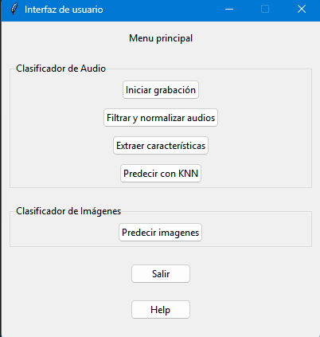
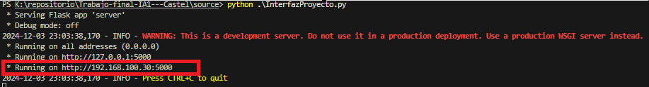
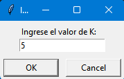
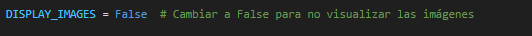
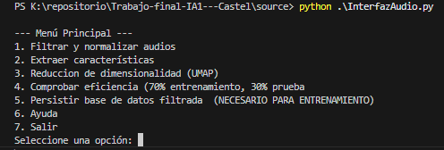
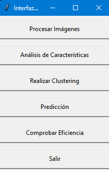

# Trabajo-final-IA1---Castel
# Proyecto Final - Inteligencia Artificial 1

Este repositorio contiene el código fuente del proyecto final de la cátedra de Inteligencia Artificial 1 (IA1) del año 2024 en la Facultad de Ingeniería de la Universidad Nacional de Cuyo.

## Descripción

El proyecto aborda el reconocimiento de objetos y audio mediante la implementación de algoritmos de aprendizaje supervisado y no supervisado. Se desarrollaron dos agentes principales:

1. **Agente de Reconocimiento de Objetos**: Utiliza el algoritmo *K-means* para la clasificación de imágenes de piezas metálicas, como tornillos, clavos, tuercas y arandelas.

2. **Agente de Reconocimiento de Audio**: Emplea el algoritmo *K-Nearest Neighbors (K-NN)* para la clasificación de palabras específicas a partir de características extraídas de señales de audio.

## Estructura del Repositorio

- **`source/`**: Contiene el código fuente principal del proyecto, organizado en módulos para cada agente y sus respectivas funcionalidades.

- **`anexos/`**: Esta carpeta contiene las diferentes carpetas con imagenes y audios
- **`runtime_files/`** : Esta carpeta contiene todos los archivos utilizados durantes la ejecución del programa general, como la base de datos de los audios `FINAL_DB` y los centroides obtenidos para el clasificador de imágenes `centroides.csv`. También contiene arhivos secundarios generados durante la etapa de aprendizaje.

- **`README.md`**: Este archivo, que proporciona una visión general del proyecto y su estructura.

## Uso
Para personalizar el aprendizaje del agente y utilizar una base de datos diferente, puede ejecutar InterfazAudio y/o InterfazImages, esto lanzará las interfaces especificas de cada agente donde en ellas se encuentran las opciones de aprendizaje correspondientes.
Si desea utilizar el programa del proyecto ejecute InterfazProyecto. (Desde la carpeta `source`)
- python .\InterfazAudios.py
- python .\Interfazimages.py
- python .\InterfazProyecto.py

Cuando lo ejecute, podra ver lo siguiente: 



Si quiere realizar la ejecución completa del programa, es decir, que al momento de la predicción de audio el mismo le muestre la imagen correspondiente, deberá ingresar al link que se le proporciona mediante el servidor `flask`.


Donde puede subir las imágenes que desee predecir. Estas se guardaran en la carpeta `anexos/img_uploads`
por lo que si no posee acceso a un navegador por algun motivo, puede cargar directamente las imágenes a esa carpeta.

Una vez realizado este procedimiento el programa mostrar la predicción correspondiente al nombre de cada archivo. Luego puede continuarse con la sección de reconocimiento de voz.
Para ello lo primero que debe hacer es hacer click en `Iniciar grabación`, una vez hecho esto en la terminal se podrá ver lo siguiente:
`Mantén presionada la tecla ESPACIO para grabar. Suelta la tecla para detener la grabación. Presiona ESC para salir.`

Una vez grabado lo/los audio/s que se deseen (los mismos se guardan test_ + numero aleatorio, ej.: `test_2413`).

Seleccionar la opción `Filtrar y normalizar audios`, luego `Extraer caracteristicas` y por ultimo `Predecir con KNN` donde se le pedirá al usuario un valor de K, se recomienda la selección de un K mayor a 3 e impar.

 

Es importante recalcar que en todo momento podra visualizar la ejecución mediante logs en la terminal.
Por último pero no menos importante, si desea visualizar el efecto de cada filtro que se le aplica a las imágenes, puede cambiar el valor de esta variable en el módulo `PrediccionImage.py`:



## Uso especifico
Si desea comprobar la eficiencia del clasificador de audios deberá ejecutar `InterfazAudio.py`, esta interfaz es la que maneja la etapa de aprendizaje, la misma puede usarse para entrenar el modelo con una nueva base de datos, o para cambiar las caracteristicas de redimensionalidad actuales (parametros de UMAP por ejemplo), si desea hacer esto, solo debe seguir el camino similar al de `InterfazProyecto.py` pero debera cargar los audios en `anexos/test_raw_v2` (se recomienda que los audios tengan el prefijo nomre_de_verdura + _ + indice), por último debe seguir los pasos tal como el índice del menú lo indica. Excepto por la opcion 5 y 4, deberia persistir la base de datos previamente a realizar una comprobación de eficiencia.




Para comprobar la eficiencia seleccione la opcion 4 y luego de cierto tiempo de cómputo y varias iteraciones, se obtendra un promedio de eficiencia.

Por otro lado para comprobar la eficiencia del clasificador de audio deberá ejecutar `InterfazImages.py`, nuevamente, si desea entrenar un modelo nuevo debe seleccionar la opcion `Procesar Imágenes` donde el programa le solicitará la seleccion de las carpetas que contengan las imagenes, cuando haya finalizado, puede seleccionar que ya no desea seleccionar más.

Como se puede ver en la interfaz, luego seleccione `Análisis características`, `Realizar clustering`, `Predicción`, este ultimo paso es necesario porque crea el archivo .csv que se utilizará para comprobar la eficiencia.

Es muy importante destacar que los nombres de las imágenes deben tener como prefijo el nombre correspondiente a lo que son, de otra forma, la comprobación de eficiencia no tendrá sentido.



Cada vez que matplotlib o tkinter muestre una gráfica deberá cerrarla para continuar con la ejecución.
## Requisitos

- **Python 3.8 o superior**: Lenguaje de programación utilizado para el desarrollo del proyecto.

- **Bibliotecas de Python**:
  - `numpy`
  - `scikit-learn`
  - `librosa`
  - `matplotlib`
  - `flask`
  - `tkinter`
  - `pandas`
  - `librosa`
  - `pydub`
  - `umap-learn`
  - `opencv-python`
  - `sounddevice`
  - `PIL`
  - `soundfile`

Estas dependencias pueden instalarse ejecutando:

```bash
pip install -r requirements.txt
